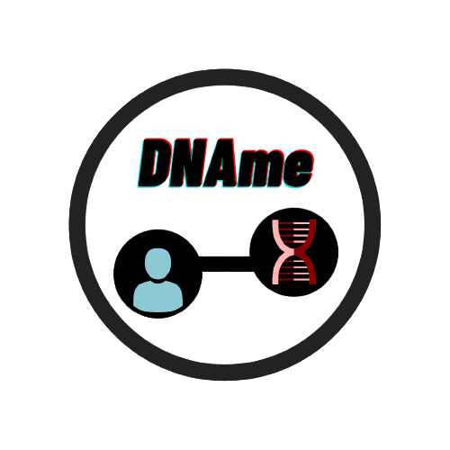

# DNAme 

## General information

Shiny application for teaching/learning purposes.

It converts names to nucleotide (either DNA or RNA) sequences.

## How it works?

To run the *DNAme* app you should go through the different steps:

1. Read the information in the *Info* section.

2. *optional* Read the theory at Wikipedia to understand the processes behind *DNAme*.

3. Go to the *DNA your name* section:

  + Select the desired parameters.
      
  + Write your name.
  
  + Click to `DNAme`
  
  + *Note that there is a result by default, this is obtained using the word 'DNAme'*.
      

## Contributors

**Developer and maintainer**: [amitjavilaventura](https://amijtavilaventura.github.io)

## License

 This work is licensed under a <a rel="license" href="http://creativecommons.org/licenses/by-nc-nd/4.0/">Creative Commons Attribution-NonCommercial-NoDerivatives 4.0 International License</a>.

